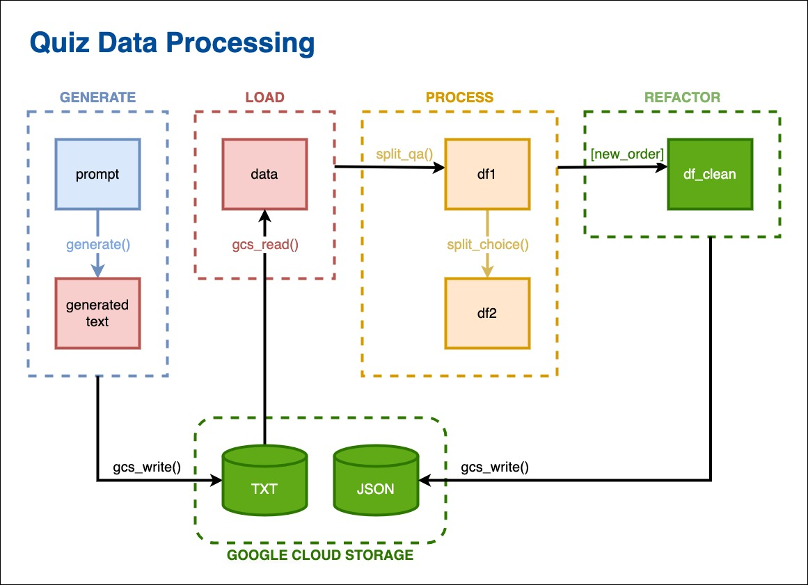

# Process quiz data from GCP Vertex AI responses

### Jupyter Notebook file: [VIEW](quiz_data_processing.ipynb)

## Diagram



## Table of contents
1. [Introduction](#introduction)
2. [Preparing](#preparing)
   1. [Import](#1-import)
   2. [Define functions interact with GCP](#2-define-functions-interact-with-gcp)
3. [Generate Vertex AI content](#generate-vertex-ai-content)
4. [Export generated data to GCS](#export-generated-data-to-gcs)
5. [Load data from GCS](#load-data-from-gcs)
6. [Process data](#process-data)
   1. [Split questions and answers from text](#1-split-questions-and-answers-from-text)
   2. [Tidy question text](#2-tidy-question-text)
   3. [Split answer text into multiple choices](#3-split-answer-text-into-multiple-choices)
   4. [Compose clean dataframe](#4-compose-clean-dataframe)
7. [Export clean data](#export-clean-data)
8. [Conclusion](#conclusion)


## Introduction

In this project, we will build a Jupyter notebook to create a synthetic quiz dataset for using in web application.

Quiz data could be generated from various open sources. These sources provide quizzes gathered from user's posting.
Considering this nature and be afraid of content right, I wanted to try other method of getting fake, or synthetic data.

As I'm dedicated to using cloud solutions from [Google Cloud Platform (GCP)](https://cloud.google.com/),
I use [Vertex AI](https://cloud.google.com/vertex-ai) to generate text data mimics quiz which input by human in common format.

From the mockup document, we will load, extract and process, re-engineer it into JSON format which is widely used for web application.

## Preparing

### 1. Import

We need to import Pandas and some other general packages.

To make GCP jobs work out, we authenticate GCP credentials
using environment variable `GOOGLE_APPLICATION_CREDENTIALS`.
It's also convenient to assign constants related to GCP services.

```
# Import general packages
import pandas as pd
import re
import io
import json

# Set environment variable to authenticate GCP credentials
!export GOOGLE_APPLICATION_CREDENTIALS='path/to/credentials.json'

LOCATION = "location"
PROJECT = 'project-name'
BUCKET = 'bucket-name'
MODEL = "gemini-1.5-flash-001"
```

### 2. Define functions interact with GCP
It's better to follow GCP docs and prepare some functions to work with GCP so that we can use later with ease.

For Google Cloud Storage (GCS), we make `gcs_read` and `gcs_write` to read and write objects.

```
# Imports the Google Cloud client library
from google.cloud import storage

def gcs_read(bucket_name, blob_name, j_load=False):
    """
    Read a blob from GCS.
    Default use readlines() for text file.
    Change `j_load` to True if json.load() is used for reading clean JSON file.
    """
    storage_client = storage.Client()
    bucket = storage_client.bucket(bucket_name)
    blob = bucket.blob(blob_name)
    with blob.open("r") as file:
        if j_load:
            return json.load(file)
        return file.readlines()
    
def gcs_write(bucket_name, blob_name, content):
    """Write a blob to GCS"""
    storage_client = storage.Client()
    bucket = storage_client.bucket(bucket_name)
    blob = bucket.blob(blob_name)
    with blob.open("w") as file:
        file.write(content)
```

For Vertex AI, we need a `generate` function as a generator to yield response text in processing.

```
# Import Vertex AI packages
import vertexai
from vertexai.generative_models import GenerativeModel
import vertexai.preview.generative_models as generative_models

def generate(p_text, g_config, s_settings):
    """Yield text with generator which receive prompt text, generation config and safety settings as arguments"""
    vertexai.init(project=PROJECT, location=LOCATION)
    model = GenerativeModel(
        MODEL,
    )
    responses = model.generate_content(
        [p_text],
        generation_config=g_config,
        safety_settings=s_settings,
        stream=True,
    )

    for response in responses:
        yield response.text
```

## Generate Vertex AI content

Define variables with value we will use for Vertex AI input.

```
prompt = """Generate quiz with these requirements:
- Total questions: 50.
- Topic: AWS.
- Difficulty: Hard.
- Types: true/false, single correct answer, multiple correct answers.
- Indent questions with number.
- Indent choices and true/false with upper letter.
- If more than 2 correct answers questions, remind  \"(select [exact number] apply)\" before choice A.
- In each question, total correct answers is less than total choices.
- Choices consist multiple technically complicated steps.
- Show correct choices at the end of each question.
- No markdown, plain text.
- Group by type."""

generation_config = {
    "max_output_tokens": 8192,
    "temperature": 1,
    "top_p": 0.95,
}

safety_settings = {
    generative_models.HarmCategory.HARM_CATEGORY_HATE_SPEECH: generative_models.HarmBlockThreshold.BLOCK_MEDIUM_AND_ABOVE,
    generative_models.HarmCategory.HARM_CATEGORY_DANGEROUS_CONTENT: generative_models.HarmBlockThreshold.BLOCK_MEDIUM_AND_ABOVE,
    generative_models.HarmCategory.HARM_CATEGORY_SEXUALLY_EXPLICIT: generative_models.HarmBlockThreshold.BLOCK_MEDIUM_AND_ABOVE,
    generative_models.HarmCategory.HARM_CATEGORY_HARASSMENT: generative_models.HarmBlockThreshold.BLOCK_MEDIUM_AND_ABOVE,
}
```

Assign generator to a variable.

```
# Assign generator to a variable
generator = generate(prompt, generation_config, safety_settings)
```

Call the generator and concatenate text from generator's responses together to make the full text.

```
# Use string comprehension to gather text from generator
generate_text = ''.join(response for response in generator)
```

## Export generated data to GCS

Extract topic, difficulty and size from prompt text.
Combine all into a new TXT file name.

```
# Read generated text as lines
buf = io.StringIO(prompt)
lines = buf.readlines()

# Extract topic
topic_line = [line for line in lines if '- Topic: ' in line][0]
topic = topic_line[9:].rstrip('\n.')
topic = re.sub(' ', '_', topic.lower())

# Extract difficulty
difficulty_line = [line for line in lines if '- Difficulty: ' in line][0]
difficulty = difficulty_line[14:].rstrip('\n.').lower()

# Extract size
size_line = [line for line in lines if '- Total questions: ' in line][0]
size = size_line[19:].rstrip('\n.')

# Combine topic, difficulty and size into .txt file name
file_name = f'{topic}_{difficulty}_{size}.txt'
```

Write the generated data to our GCS bucket with prepared file name in TXT format.

```
# Assign file_name to a constant using for writing to GCS
WRITE_BLOB = file_name

gcs_write(BUCKET, WRITE_BLOB, generate_text)
```

## Load data from GCS

We will use the same file we've just exported for the purpose of loading data from GCS.

```
# Assign file_name to a constant using for reading from GCS
READ_BLOB = file_name

data = gcs_read(BUCKET, READ_BLOB)
```

## Process data

### 1. Split questions and answers from text

Define function `split_qa`.

```
def split_qa(lines_data):
    """
    Accepts list of lines.
    Returns a dictionary with keys `question` and `answer`
    """
    dict_data = {'question': [],
                 'answer': []}
    
    # Switch determines if the last line is in question section or not
    q_prev = False
    
    for line in lines_data:
    
        # Strip '**' style around 'Correct answer(s)' or 'Correct'
        line = line.replace('**', '')
        
        # Check if line is not blank, title or heading ('##')
        if (line != '\n') and ('##' not in line):
        
            # Call the first word of the line is `head`
            head = line.split()[0]
            
            # Append new question if all of these meet:
            # - Previous line is not in question text
            # - First character of `head` is numeric
            # - Last character of `head` is '.'
            if (not q_prev) and head[0].isnumeric() and head[-1] == ".":
                dict_data['question'].append(line)
                q_prev = True
    
            # Append new answer if all of these meet:
            # - Previous line is in question text
            # - `head` is 'A.'
            elif q_prev and head == 'A.':
                dict_data['answer'].append(line)
                q_prev = False
    
            # Add line to unfinished question
            elif q_prev:
                dict_data['question'][-1] += line
        
            # Add line to unfinished answer
            else:
                dict_data['answer'][-1] += line
    
    return dict_data
```

Call the function and convert the result into DataFrame class.

```
# Return split_qa result to a variable
dict0 = split_qa(data)

# Convert `dict0` to a DataFrame
df0 = pd.DataFrame(dict0)
```

### 2. Tidy question text

Tidy question text by stripping indentation and new lines character.

```
# Make a copy of df0
df1 = df0.copy()
```
```
# Strip the number at the beginning and '\n' at the end of each question 
df1['question'] = df1['question'].str.replace(r'^\d{0,4}\.[ ]', '', regex=True).str.rstrip()
```

### 3. Split answer text into multiple choices

Define `split_choice` function to split answer text into multiple choices.
Choices will be confirmed as correct and incorrect thereafter.

```
def convert_index(capital):
    """Return zero-based index from capital, 'A' has unicode code as 65"""
    return ord(capital) - 65

def split_choice(answer):
    """
    Split the `answer` data into multiple choices
    """
    # Use 'Correct Answer(s): ' to split text.
    # Index 0 is all choices, index 1 is all answers
    split_all = re.split(r'Correct Answer[s]*: ', answer)
    choices = split_all[0]
    correct_stack = split_all[1]
    
    # Split using ','
    correct_stack = correct_stack.split(',')
    
    # Pick only first capital indicating the choices
    correct_note = [item.strip()[0] for item in correct_stack]
    
    # Make zero-based index from alphabet
    correct_index = [convert_index(item) for item in correct_note]
    
    # Split using 'X. ', index 0 is '', so pass
    choices = re.split(r'[A-Z]\.[ ]', choices)[1:]
    # Strip right side of choice text
    choices = [choice.rstrip() for choice in choices]
    
    # Separate choices into lists as `incorrect` and `correct`
    incorrect = [choice for index, choice in enumerate(choices) if index not in correct_index]
    correct = [choice for index, choice in enumerate(choices) if index in correct_index]
    
    return {'incorrect': incorrect,
            'correct': correct}
```

Apply `split_choice` to dataset and store choices in new columns, named `incorrect` and `correct`. 

```
# Make a copy of `df1`
df2 = df1.copy()
```
```
# Apply the function to full dataset
df2['incorrect'] = df2['answer'].apply(split_choice).str['incorrect']
df2['correct'] = df2['answer'].apply(split_choice).str['correct']
```

### 4. Compose clean dataframe

To save space and memory, we should include only columns that we need.
In this case, `question` and clean `incorrect`, `correct` are all that we will use directly in our webb app.

```
# New order of columns
new_order = ['question', 'incorrect', 'correct']

# Make a copy of `df2` with new order of columns
df_clean = df2[new_order].copy()
```

## Export clean data

Now we can convert our data into JSON string and load it to GCS object as a JSON file for later application.

```
# Pick up the read blob name with '.txt' excluded, to make new json file name
JSON_BLOB = READ_BLOB[:-4] + '.json'

# Convert `df_clean` to JSON string
json_string = df_clean.to_json()
```
```
# Write JSON string to GCS object as a JSON file
gcs_write(BUCKET, JSON_BLOB, json_string)
```

## Conclusion

From human-input form, the document is finally transformed into a parsable form, as a JSON file.
Now it's ready to use in web application.

There may be demand for other applications, such as analytics, interactive database, with more complex architects than general JSON format.
In these cases, we can always take further steps with our original flow to work things out.